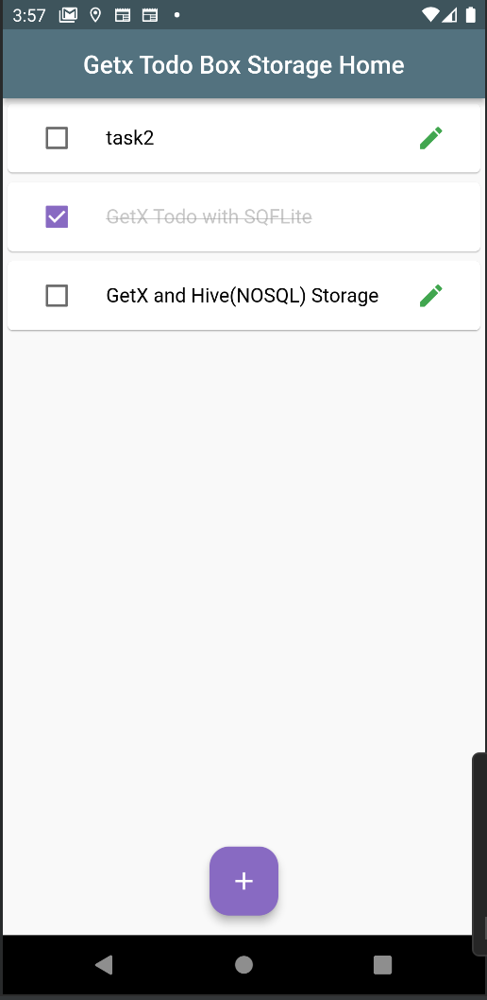
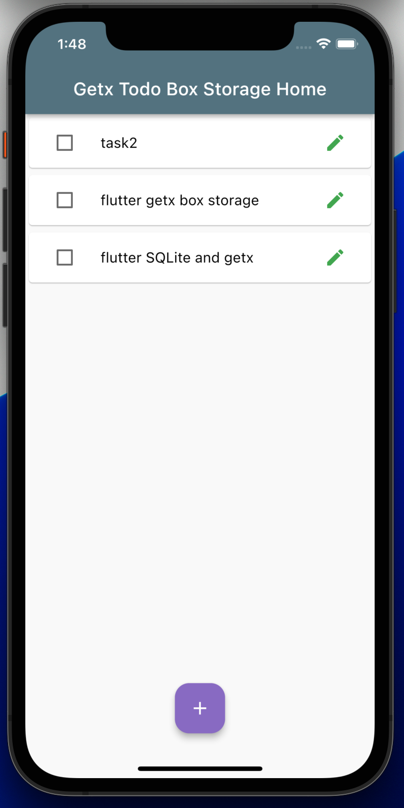
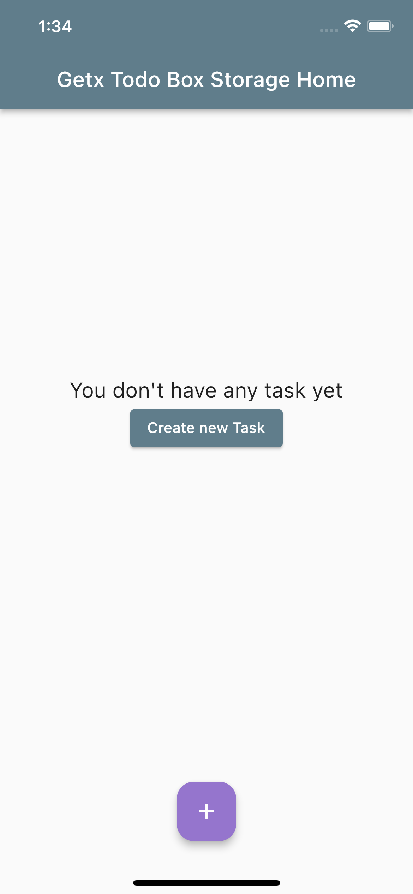
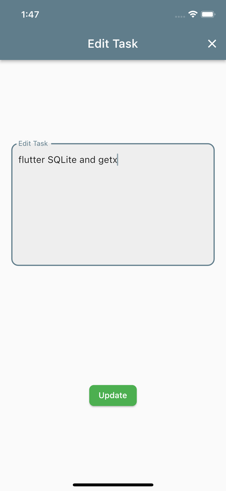

### Flutter Todo App- GetX and GetStorage

- Todo App with todo ListView page, edit task page and add task page.
- Create, Read, Update and Delete tasks.
- GetX  used for state management.
- GetStorage used for local storage(Persistent, but not recommended for todo app type storage purpose, 
   best used for small quick storage solution like user info, etc).
- MVC architecture used.
- dismissible widget used for swipe to delete task.
- snackbar used to show task deleted messages.

# See  quick Video & Screenshots below:

 

 
| :------------------------------------------------------------:  |  :--------------------------------------------|
| | |
| | |
 .
